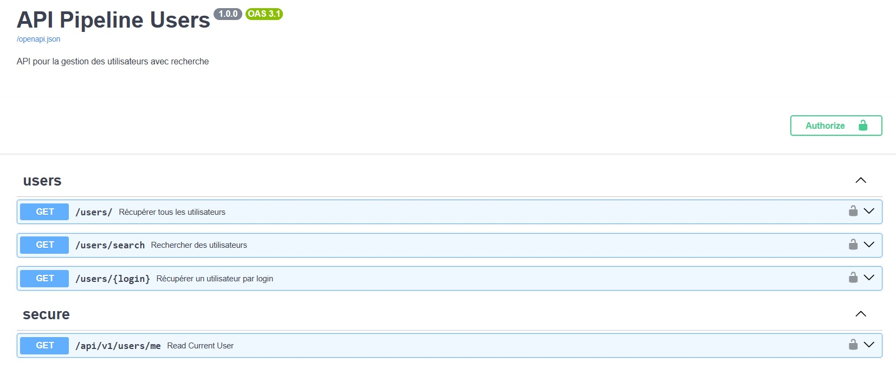
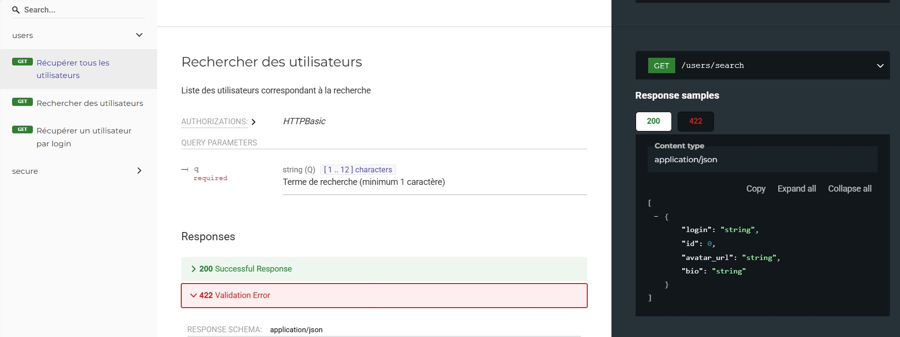
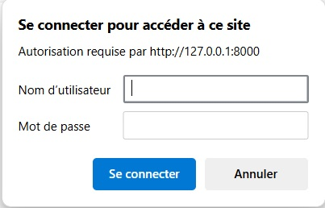

# 📊 API Utilisateurs GitHub — Projet Python / FastAPI



Ce projet a pour objectif de :
- Récupérer des utilisateurs depuis l’API GitHub (login, id, bio, avatar...),
- Filtrer et nettoyer les données (bio non vide, date > 2015...),
- Les exposer via une API REST sécurisée (authentification HTTP Basic).

## 🗂️ Structure du projet

```
api_pipeline/
├── extract_users.py         # Extraction depuis l'API GitHub (avec token + pagination)
├── filtered_users.py        # Filtrage des données utilisateurs
├── data/
│   ├── users.json           # Données brutes extraites
│   └── filtered_users.json  # Données nettoyées et filtrées
├── api/
│   ├── main.py              # Lancement de l’API FastAPI
│   ├── routes.py            # Endpoints : /users/, /users/{login}, /search?q=...
│   ├── security.py          # Authentification HTTP Basic (admin / admin123)
│   └── models.py            # (Optionnel) Modèles Pydantic
└── README.md
```

---

## 🚀 Lancer le projet

### 1. 🧪 Extraction des utilisateurs GitHub
```bash
python extract_users.py
```
Le script récupère les utilisateurs via l'API GitHub, gère les quotas, les erreurs, et enregistre dans `data/users.json`.

### 2. 🧼 Nettoyage et filtrage
```bash
python filtered_users.py
```
Filtrage : bio non vide, avatar valide, date postérieure à 2015.
→ Résultat dans `data/filtered_users.json`.

### 3. 🌐 Lancement de l’API FastAPI
Depuis le dossier `api_pipeline/api/`, exécuter :
```bash
uvicorn main:app --reload --port 8000
```


Interface Swagger : http://localhost:8000/docs  
Interface ReDoc : http://localhost:8000/redoc

---

## 🔐 Authentification HTTP Basic



L’API est protégée. Utilisez :  
- **login** : `admin`  
- **mot de passe** : `admin123`

Chaque route protégée demande une authentification.

---

## 🔍 Exemple de requêtes CURL

### ➤ Récupérer tous les utilisateurs
```bash
curl -u admin:admin123 http://localhost:8000/users/
```

### ➤ Récupérer un utilisateur précis
```bash
curl -u admin:admin123 http://localhost:8000/users/haninh2612
```

### ➤ Rechercher un utilisateur par mot-clé
```bash
curl -u admin:admin123 http://localhost:8000/users/search?q=a
```

---

## 🔄 Exemple de réponse JSON

```json
{
  "login": "haninh2612",
  "id": 1,
  "avatar_url": "https://avatars.githubusercontent.com/u/1?v=4",
  "bio": "Founder of icebreaker."
}
```

---

## 🛠️ Technologies

- Python 3.10+
- FastAPI
- Uvicorn
- requests, dotenv, json, pathlib, pytest, Optional
